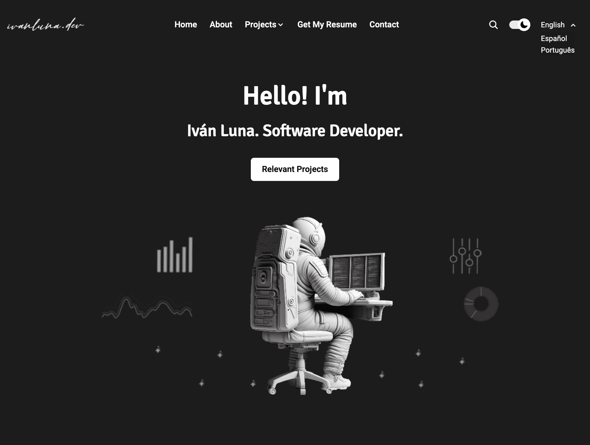
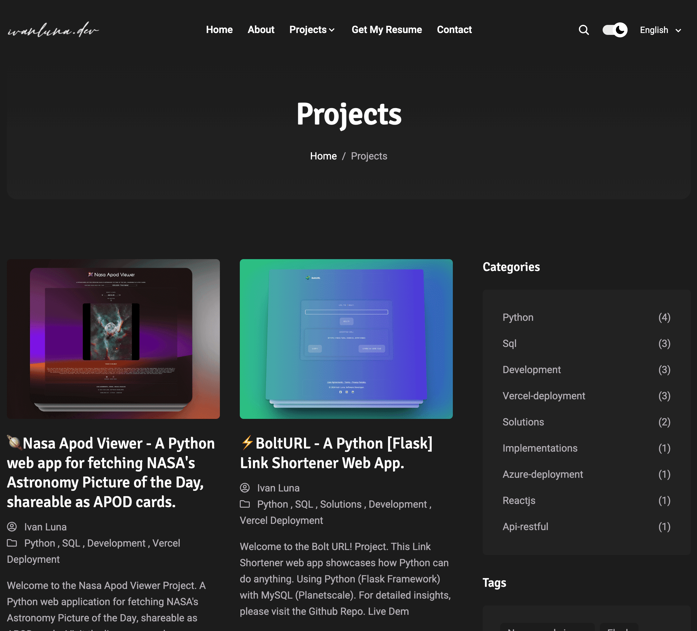
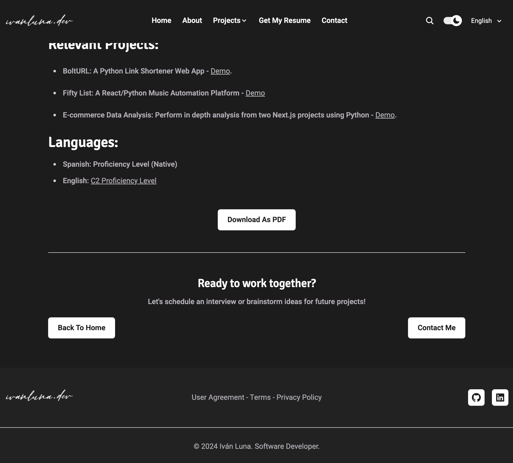

# Welcome to the [ivanluna.dev](https://ivanluna.dev/) Portfolio.

Welcome to my personal portfolio website, an elegant Astro project meticulously crafted using Astro, TypeScript, SCSS, and JavaScript. This platform serves as a showcase for my creative projects, professional journey, and expertise as Software Developer. All presented in a user-friendly and visually appealing manner.


**Table of Contents**

- [Iván Luna Software Developer Portfolio](https://br.ivanluna.dev)
  - [Features](#features)
  - [Preview](#preview)
  - [Run the Application](#run-the-application)
    - [1. Requirements](#1-requirements)
    - [2. Clone the Source](#2-clone-the-source)
    - [3. Install Dependencies](#3-install-dependencies)
    - [4. Start the Application](#4-start-the-application)
  - [Known Issues \& To-do](#known-issues--to-do)
  - [Feedback \& Support](#feedback--support)
  - [License](#license)

## Features
Here is an overview of the most important functions and features of the project.

**Technologies Used:**

- Astro: 60.0%
- TypeScript: 22.0%
- SCSS: 9.1%
- JavaScript: 7.6%
- Dockerfile: 1.3%
  
**Functionality**
  
- Language Selector: Allows users to switch between English, Spanish, and Portuguese languages for the website interface.
- Theme Toggle: Enables users to switch between light and dark themes for better readability and user preference.
- Interactive PDF Resume: Provides users with a downloadable PDF resume featuring clickable hyperlinks for easy navigation to additional information.
- Project Showcase: Displays projects in a curated format, with previews of up to 4 projects per page. Users can navigate through categories and tags to explore projects further and access detailed project information and demos.
- Contact Form: Allows users to submit inquiries or messages via a contact form. Form submissions are processed securely using a Netlify function, ensuring reliable email delivery.
- Search Functionality: The search feature is also enabled, providing an intuitive search engine that facilitates user queries.

## Preview



---



---



## Run the Application
Follow these steps to run the application.

### 1. Requirements
All you need is a web browser like one of the following:

- [Google Chrome](https://www.google.com/chrome/)
- [Mozilla Firefox](https://www.mozilla.org/en-US/firefox/new/)
- [Microsoft Edge](https://www.microsoft.com/en-US/edge)


### 2. Clone the Source:
Clone the source code or download the repository on your local computer by clicking the **Code** button.

``` bash
git clone https://github.com/imprvhub/ivanlunadev-portfolio.git
```

### 3. Install Dependencies:
Install the required dependencies.

``` bash
npm install
```

### 4. Start the Application
From your IDE terminal navigate to the root of the project and execute the following command:
``` bash
npm run dev
```
Then it should be accessible at:
```
http://localhost:4321
```

## Known Issues & To-do
This is an overview of the already known problems and bugs as well as a collection of things that still need to be done.

**Known issues**

- From mobile dimensions, if the user expands the 'nav-menu' and then resizes the screen to more than 1024px width, the nav-menu breaks. While this behavior may not be common, it's important to maintain consistency in responsive interactions for all user interactions.


**To-do**

- Fix the responsive behavior of the nav-menu when transitioning from mobile to desktop using an intersection observer.

## Feedback & Support
Your feedback is important, and I'm here to assist you with any questions or concerns. Your input plays a crucial role in enhancing the project and optimizing the user experience. Feel free to reach out to me:

- **Feedback:** Share your thoughts, suggestions, or ideas with me so that I can continuously work towards improvement.

- **Support Inquiry:** If you encounter difficulties or need assistance, [create a new GitHub issue](https://github.com/imprvhub/ivanlunadev-portfolio/issues/new). Please describe your issue in detail to enable me to provide quick and accurate support.

Thank you for your support!

## License
For more information regarding this topic please read the following [User Agreement Section.](https://ivanluna.dev/user-agreement/)
